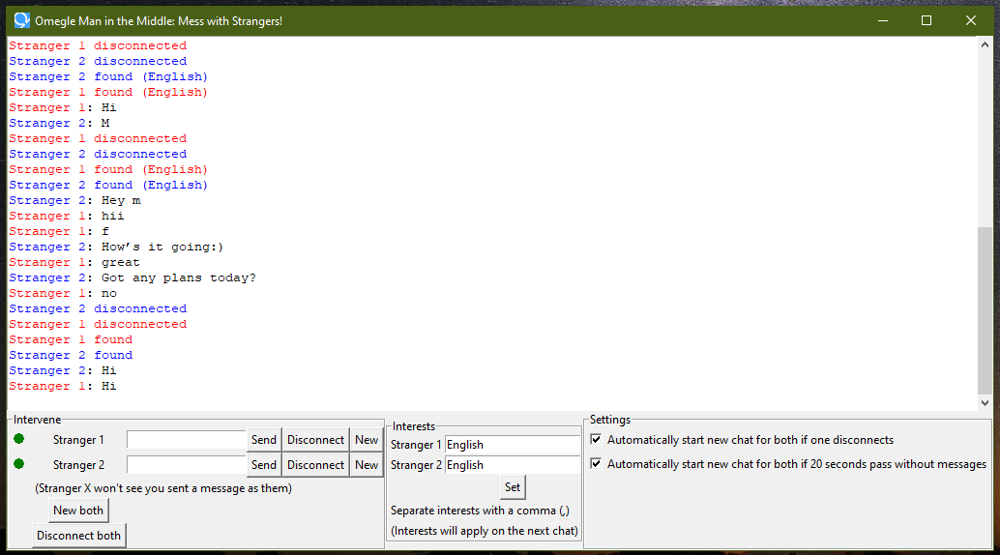

## Omegle Man in the Middle


## Warnings
- You might get banned from the moderated section if you keep this running for too long, you'll know when it happens because an exception will occur. The program will still work in the unmoderated section, just close and reopen it after the exception.
- If it gets stuck on searching for a new chat that means you're being blocked by captchas that Omegle uses to stop bots, and with this program you're essentially a tunnel for bots.

## Requirements
- Firefox

## How to use
```shell
git clone https://github.com/TommasoTricker/Omegle-MITM.git
cd .\Omegle-MITM
pip install selenium, pillow
python main.py
```

Tick both settings to make it run automatically.

## How it works
Starts two Omegle chats and sends all messages from one to the other, creating a conversation between two strangers.